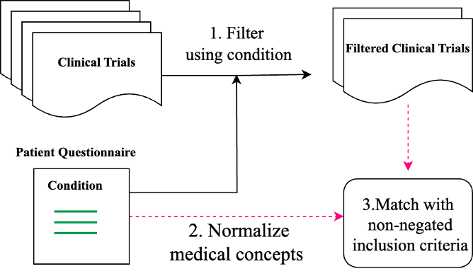
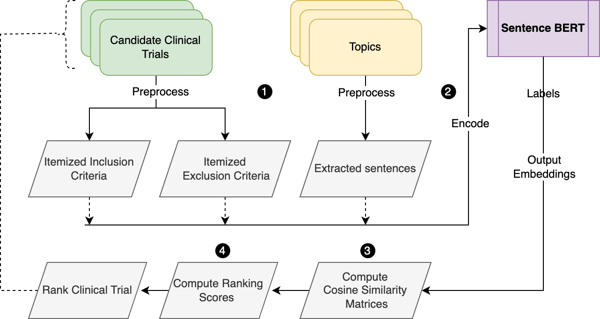
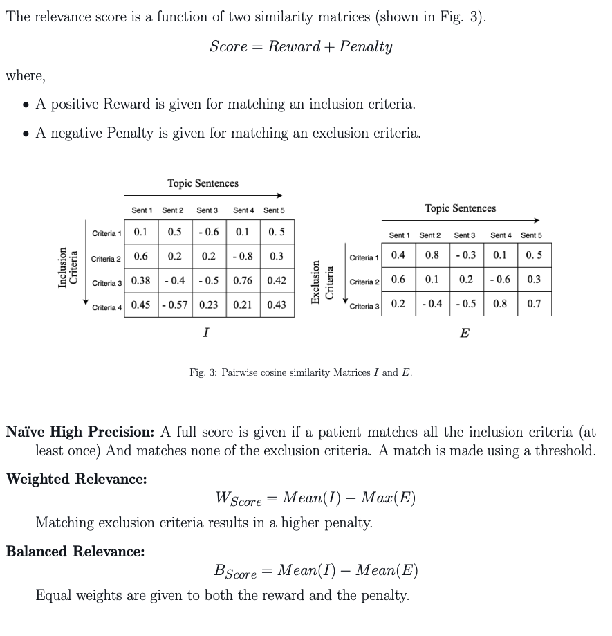

# TREC Clinical Trial Challenge 2023
> Members: Mozghan Saedi, Aman Jaiswal, Abhishek Dhankar

## Abstract
In our approach to the TREC clinical trial matching problem, we use a two-stage process for effectively ranking and re-ranking clinical trials pertaining to a specific disorder. First, we identify
candidate trials by matching normalized medical terms and non-negated inclusion/exclusion criteria to the disorder. Then, we rank the candidates using weighted relevance scores based on cosine similarity between contextual embeddings of the disorder and trial criteria. We use three different weighting schemes to compute a matching score. The unique aspect of our approach lies in the innovative use of these criteria to filter clinical trials and in the weighted
relevance scoring, which reflects the varying importance of inclusion and exclusion criteria. Once we have computed the weighted relevance score for each candidate clinical trial,
we rank the clinical trials by their score. Our submission performs better in terms of Precision@10 and NDCG-cut-10 than the median scores of the TREC 2023 Clinical trials track.

Our two stages of our approach are described below:

### Stage 1: Ranking 

Step 1: Extract the inclusion and exclusion criteria and normalize the medical concepts using a knowledge base (UMLS).\
Step 2: Match the concepts in the patient’s questionnaire with the extracted concepts.\
Step 3: Rank based on the number of matches.

### Stage 2: Re-Ranking using similarity matrix

Step 1: Itemize the inclusion and exclusion criteria. \
Step 2: Convert the questionnaire responses into sentences.\
Step 3: Encode the itemized criteria and responses into contextual embeddings.\
Step 4: Compute pairwise cosine similarity between criteria and the responses, resulting in two matrices. \
Step 5: Compute ranking scores based on the similarity matrices.

## Code:
1. `parse-rank-rerank.ipynb` python notebook provides the code for both stage 1 and 2.
2. `results-analysis.ipynb` reproduces the results in the paper.
3. `clean_topic_sentence.csv` is output of the converting the XML TREC topics into sentences. 
4. `final_results.p` is output of stage 1 in pickle format.